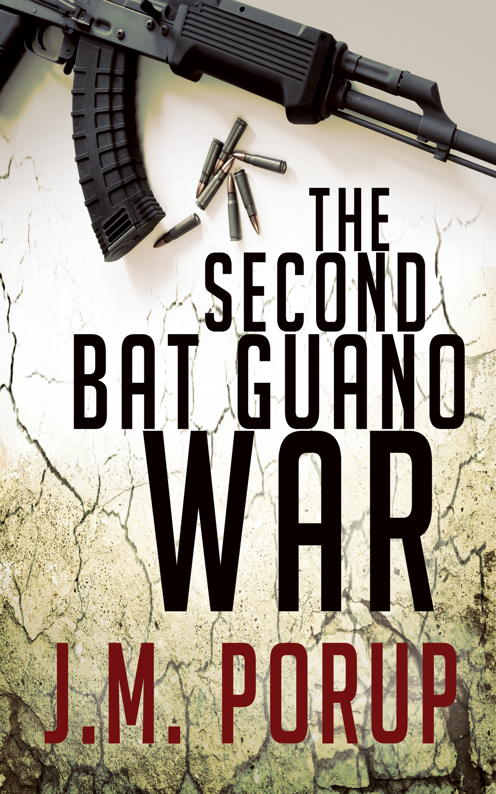

second-bat-guano-war
====================

Welcome to my series of GitHub novels.

As a ex-hacker turned novelist, I license all my work Creative Commons.
So why not release my work on GitHub?

If you like the book, hit me up with some Bitcoin:

    1EHrErtNUL9bEWrQ9aeNqBLjTiojJx7Ecb

And if you're broke? Tell a friend. Or even better, leave a review. :)

See HOWTO for conversion instructions.

book details
============

**Title:** *The Second Bat Guano War*

**Genre:** Hard-Boiled Noir

**Word Count:** 100,000

**Book Description:**

**From former *Lonely Planet* author J.M. Porup comes this gritty South American noir...**

Rats ate his baby daughter while he partied in a disco. Now Horace
“Horse” Mann is a drugged-out expat teaching English to 
criminals in Lima, Peru. Oh, and doing the odd favor for the CIA.

When his Agency contact, Pitt Watters, goes missing, Horse’s
desperate efforts to find his only friend lead him to a Buddhist ashram
on the shores of Lake Titicaca. There Horse uncovers his friend’s
involvement with a group of Gaia-worshipping terrorists who want to kill
off the human “disease” infecting the earth.

Can Horse find his friend in time? And when he does—will he want to 
stop him?
